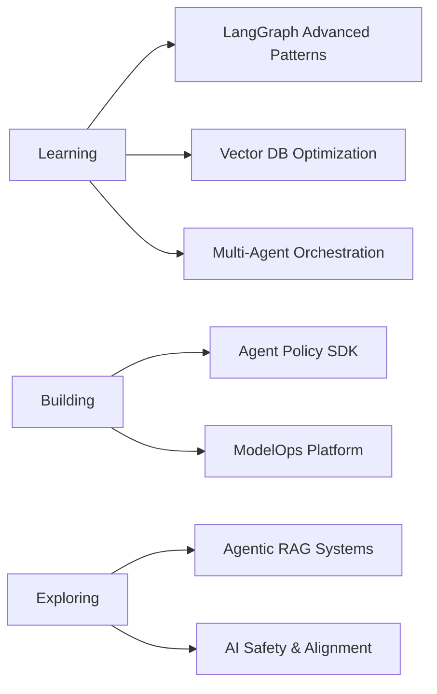

# Rahul | AI Engineer & Backend Systems Architect

<div align="center">
  
  ### Crafting Intelligent Multi-Agent Systems & Production-Grade AI Infrastructure
  
  [](mailto:rahulsagar280103@gmail.com)
  [](https://linkedin.com/in/rahulsagar21)
  [](https://instagram.com/me.rahuull)
  
  
  
</div>

---

## 👨‍💻 About Me

AI Engineer specializing in **production-grade intelligent systems** that scale. I architect and build multi-agent AI platforms, advanced RAG pipelines, and robust backend infrastructure that powers real-world AI applications.

```python
class RahulSagar:
    def __init__(self):
        self.role = "AI Engineer & Backend Architect"
        self.focus = [
            "Multi-Agent Orchestration (LangGraph)",
            "RAG Pipeline Engineering", 
            "Scalable Backend Systems",
            "Production AI Deployments"
        ]
        self.currently_building = ["Agent Policy SDK", "ModelOps Platform"]
        
    def daily_workflow(self):
        return [
            "Design intelligent agent architectures",
            "Implement vector search & retrieval systems", 
            "Build high-performance APIs",
            "Deploy & monitor AI systems at scale"
        ]
```

### 🎯 What I Do

- 🤖 **Multi-Agent Systems** - Orchestrate complex agent workflows with LangGraph, manage state machines, implement autonomous decision-making
- 🔍 **RAG Engineering** - Design semantic search systems, optimize vector databases (Qdrant, Pinecone), build knowledge integration pipelines
- 🏗️ **Backend Architecture** - Scalable microservices, high-performance APIs with FastAPI, distributed system design
- ☁️ **AI Infrastructure** - Docker containerization, AWS deployment, monitoring & observability for AI workloads

---

## 🛠️ Tech Arsenal

<details open>
<summary><b>🤖 AI & LLM Stack</b></summary>
<br>


</details>

<details open>
<summary><b>🔌 Data & Vector Stores</b></summary>
<br>


</details>

<details open>
<summary><b>⚡ Backend & APIs</b></summary>
<br>


</details>

<details>
<summary><b>☁️ Cloud & DevOps</b></summary>
<br>


</details>

<details>
<summary><b>🎨 Frontend & Visualization</b></summary>
<br>


</details>

---

## 🚀 Featured Projects

<table>
<tr>
<td width="50%">

### 🛡️ Agent Policy SDK
**Open-source guardrails framework for LLM applications**

Production-ready safety controls, policy enforcement, and compliance mechanisms for LangChain, LlamaIndex, and LangGraph-based agents.

**Key Features:**
- 🔒 Policy enforcement layer for agent actions
- 🛡️ Content filtering & safety guardrails  
- 📊 Audit logging & compliance tracking
- 🔌 Drop-in integration with major frameworks

**Stack:** `Python` `LangGraph` `FastAPI` `PostgreSQL`

[]()

</td>
<td width="50%">

### 🔄 ModelOps Platform
**Multi-model orchestration with cost/latency optimization**

Compare, benchmark, and dynamically route requests across different LLM providers. Integrated evaluation framework for intelligent model selection.

**Key Features:**
- 🎯 Multi-provider routing (OpenAI, Anthropic, AWS Bedrock)
- 📊 Real-time cost & latency benchmarking
- 🧪 Integrated evaluation framework
- 🔄 Smart caching & request optimization

**Stack:** `Python` `FastAPI` `PostgreSQL` `Redis` `AWS`

[]()

</td>
</tr>
</table>

---

## 📊 GitHub Stats

<div align="center">


</div>

<div align="center">
  


</div>

<div align="center">
  
</div>

---

## 💡 Development Philosophy

> *"Build systems that are not just intelligent, but intelligent enough to be trusted in production."*

### 🎯 Core Principles

```yaml
pragmatic_ai:
  focus: "Solve real problems, not showcase capabilities"
  approach: "Ship working solutions, iterate based on feedback"

responsible_development:
  priority: ["Security", "Safety", "Ethics", "Privacy"]
  principle: "AI systems that respect users and data"

scalable_by_design:
  architecture: "Built to grow without technical debt"
  methodology: "Start simple, scale when needed"

production_first:
  mindset: "Reliability > Flashy features"
  practice: "Comprehensive testing, monitoring, observability"
```

### 🔍 My Approach

- **Research-Driven** - Stay current with latest AI/ML research, evaluate new techniques critically
- **Hands-On** - From architecture to deployment, involved in every layer
- **Collaborative** - Best solutions emerge from diverse perspectives
- **Open Source** - Give back to the community that accelerates us all

---

## 📈 What I'm Currently Working On



---

## 🤝 Let's Collaborate

I'm always interested in:
- 🧠 Discussing AI architecture & system design
- 🤝 Contributing to open-source AI/ML projects  
- 💼 Exploring interesting problems in AI engineering
- 📚 Sharing knowledge & learning from others

**Open to:** Collaborations, Consulting, Speaking Opportunities

---

## 📫 Get In Touch

<div align="center">

### Want to discuss AI systems, collaborate on a project, or just chat?

[](mailto:rahulsagar280103@gmail.com)
[](https://linkedin.com/in/rahulsagar21)

</div>

---

<div align="center">

### 💭 Daily Inspiration


<br>

**Thanks for visiting!** ⭐️ Feel free to star any repos you find interesting


</div>
